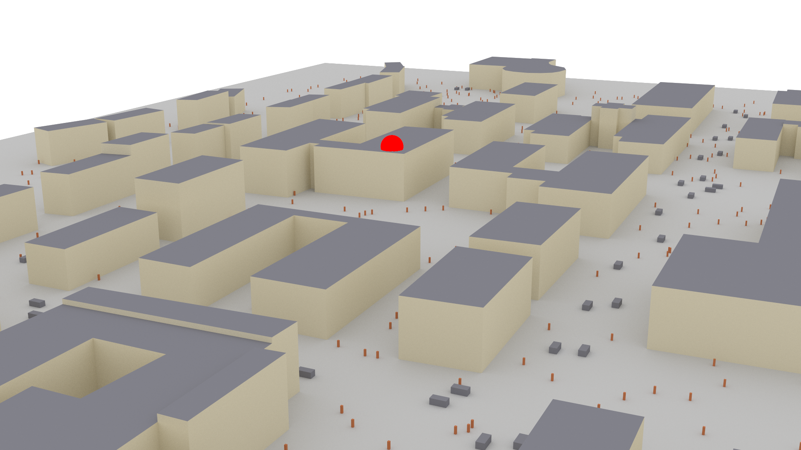

# LAD-CKM
## Dataset of [Location-Agnostic Channel Knowledge Map Construction for Dynamic Scenes](https://arxiv.org/abs/2603.09273)
---
### Dataset is available [Here](https://pan.baidu.com/s/1TaqtsnxjyytFfnBe4YYl-A?pwd=8xje).


## Dataset Overview
This is a dynamic MIMO-OFDM channel dataset created in a UMi campus scenario via ray-tracing. The 3D geometry is downloaded from [OpenStreetMap](https://www.openstreetmap.org/). The scene is imported into [Blender](https://www.blender.org/) for material parameterization and then fed into the [Sionna](https://github.com/nvlabs/sionna) ray-tracing platform to generate ground-truth MIMO-OFDM channels. To simulate environment dynamics, we randomly reposition dynamic scatterers in every coherence block, where pedestrians are modeled as dry dielectric boxes ($0.5$ m $\times$ $0.5$ m $\times$ $1.8$ m) and vehicles as metal boxes ($2$ m $\times$ $4$ m $\times$ $1.6$ m). The OFDM bandwidth is $20$ MHz, split into $64$ sub-carriers with $312.5$ kHz spacing, where $52$ sub-carriers are used for channel measurement. The central frequencies are set to $6.715$ GHz (uplink) and $6.765$ GHz (downlink). We consider BS antenna counts $N_t \in \{8, 16, 32, 64, 128\}$ and UE antenna counts $N_r \in \{1, 4\}$. For each MIMO configuration $(N_t, N_r)$, $20$ coherence blocks are generated, with $2,500$ UEs randomly dropped per block.

## Usage
+ See the example of loading the dataset in `loader.py`.

## Citation
If you find this dataset useful for your research, please cite our paper
``` bash
@article{ ladckm,
  title={Location-Agnostic Channel Knowledge Map Construction for Dynamic Scenes},
  author={Kequan Zhou and Guangyi Zhang and Hanlei Li and Yunlong Cai and Shengli Liu and Guanding Yu},
  journal={arXiv preprint arXiv:2603.09273},
  year={2026}}
```

